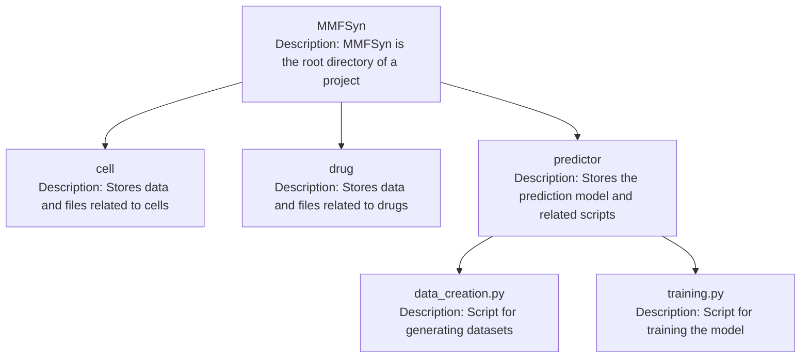

# MMFSyn
## Table of Contents
1. [Introduction](#1-introduction)
2. [Usage](#2-usage)
   1. [Installation](#21-installation)
   2. [Environment Requirement](#22-environment-requirement)
   3. [Dataset](#23-dataset)
   4. [Quick Start](#24-quick-start)
   5. [Code Description](#25-code-description)

## 1. Introduction
This is the detailed code and usage guide for the MMFSyn model, as featured in the research paper titled "MMFSyn: a multimodal deep learning framework for predicting anticancer synergistic drug combinations".

## 2. Usage
### 2.1 Installation
To use MMFSyn you must make sure that your python version is greater than 3.7. If you don’t know the version of python you can check it by:

```python
>>> import platform
>>> platform.python_version()
'3.9.12'
```

### 2.2 Environment Requirement
The required packages are as follows:
- PyTorch==1.11.0
- PyTorch-Geometric==2.0.4
- numpy==1.22.4
- scikit-learn==1.1.1
- rdkit==2022.03.2

### 2.3 Dataset
We use a widely-recognized dataset, specifically, the large-scale collaborative dataset released by O'Neil and colleagues, as the benchmark for training and evaluating our model. This dataset encompasses 23052 data entries from 39 cancer cell lines across 7 tissues, featuring 583 different drug combinations. There are 38 drugs in this dataset, 24 of which are FDA approved and 14 are experimental.

### 2.4 Quick Start
#### 2.5 Code Description


#### Specific Process
First, you need to be in the ~/MMFSyn/predictor file directory, and then run the following code:

```python
python data_creation.py
```

Then run the following code:

```python
python training.py
```
