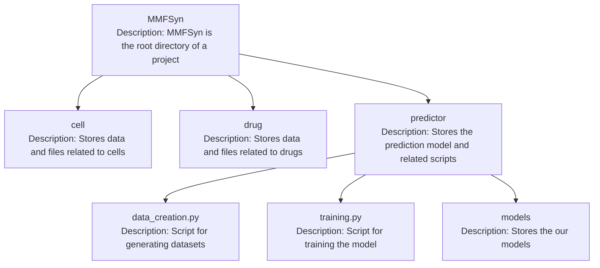

# MMFSyn
## Table of Contents
1. [Introduction](#1-introduction)
2. [Code Description](#2-code-description)
3. [Usage](#3-usage)
   1. [Installation](#31-installation)
   2. [Environment Requirement](#32-environment-requirement)
   3. [Dataset](#33-dataset)
   4. [Quick Start](#34-quick-start)

## 1. Introduction
This is the detailed code and usage guide for the MMFSyn model, as featured in the research paper titled "MMFSyn: a multimodal deep learning framework for predicting anticancer synergistic drug combinations".

## 2. Code Description


## 3. Usage
### 3.1 Installation
To use MMFSyn you must make sure that your python version is greater than 3.7. If you don’t know the version of python you can check it by:

```python
>>> import platform
>>> platform.python_version()
'3.9.12'
```

### 3.2 Environment Requirement
The required packages are as follows:
- PyTorch==1.11.0
- PyTorch-Geometric==2.0.4
- numpy==1.22.4
- scikit-learn==1.1.1
- rdkit==2022.03.2

### 3.3 Dataset
We use a widely-recognized dataset, specifically, the large-scale collaborative dataset released by O'Neil and colleagues, as the benchmark for training and evaluating our model. This dataset encompasses 23062 data entries from 39 cancer cell lines across 7 tissues, featuring 583 different drug combinations. There are 38 drugs in this dataset, 24 of which are FDA approved and 14 are experimental.In other words, this dataset contains 23062 quadruples, each including two drugs, a cancer cell line, and corresponding synergistic effect scores. For the model training and evaluation, we divide them into the training set and the test set at a ratio of 9:1.

### 3.4 Quick Start
First, you need to be in the ~/MMFSyn/predictor file directory, and then run the following code:

```python
python data_creation.py
```

Then run the following code:

```python
python training.py
```
